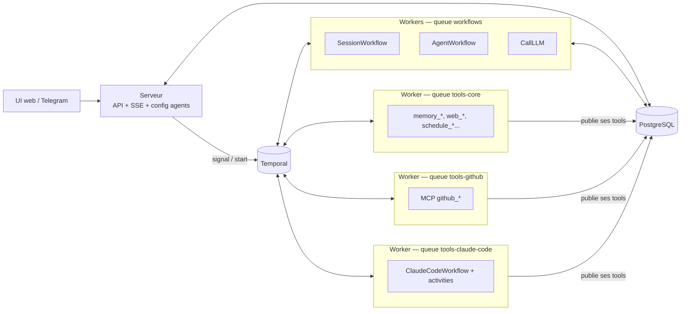

# Modèle cible — temporal-agent

Ce document fixe le modèle vers lequel le projet converge. Il sert de repère :
toute évolution doit pouvoir se situer par rapport aux concepts et aux règles
ci-dessous. Les écarts avec le code actuel sont listés en fin de document.

> Statut : **cible**. Une partie n'est pas encore implémentée (voir « État actuel »).

## But

Faire tourner des agents LLM de manière **durable** grâce à Temporal : un agent
reçoit un message, raisonne, appelle des outils, délègue à d'autres agents,
pose des questions à l'utilisateur, planifie des tâches — et tout cela survit
aux redémarrages, aux pannes de workers et aux attentes longues.

## Concepts

| Concept | Ce que c'est | Source de vérité |
|---|---|---|
| **Agent** | Une persona : nom, description, skills, outils autorisés (allowlist). Ne dit rien de *où* il s'exécute. | Table `agents` (éditable via l'UI). `agents.yaml` sert uniquement de seed. |
| **Skill** | Des instructions métier (markdown) injectées dans le prompt d'un agent. | Repo Git (`SKILLS_REPO`) ou `./skills` en dev. |
| **Tool** | Une action exécutable : nom, description, schéma d'entrée (JSON Schema). Codé en Go ou découvert via un serveur MCP. | Déclaré par les workers, publié dans la table `tools`. |
| **Worker** | Un processus qui expose un ensemble d'outils sur **une queue**. | Sa propre config locale (`worker.yaml`). |
| **Queue** | Une **capacité** : un pool de workers équivalents capables d'exécuter les mêmes outils. | Déclarée par la config worker. |
| **Session** | Une conversation et son historique (`SessionWorkflow`, long-lived). | Temporal + table `messages`. |
| **Exécution** | Un tour d'agent (`AgentWorkflow`) et ses enfants : sous-agents, questions, workflows déterministes (ex. Claude Code). | Temporal + arbre d'exécution en base (prévu). |

## Règles

1. **Le LLM décide *quoi*, le code décide *comment*.**
   Toute séquence d'étapes obligatoires (cloner, brancher, pousser, nettoyer…)
   est un workflow déterministe exposé comme un seul outil. On ne compte pas sur
   le LLM pour enchaîner correctement des étapes.

2. **Une queue = une capacité. Jamais un agent, jamais une machine.**
   - Tous les workers d'une même queue exposent exactement les mêmes outils.
   - Des outils identiques s'exécutent sur la même queue. La cohérence est de la
     responsabilité de celui qui paramètre les workers.
   - Le nom de la queue ne dépend pas de l'instance (pas de hostname) : plusieurs
     réplicas partagent la queue, Temporal répartit la charge.

3. **La cohérence d'état est gérée par l'appelant, via une session Temporal.**
   Pour les outils à état (fichiers, exec, workspace), le workflow appelant ouvre
   une session Temporal sur la queue de l'outil ; Temporal épingle l'instance.
   Aucune queue n'identifie une machine.

4. **Un agent est logique et peut tourner n'importe où.**
   `AgentWorkflow` est de l'orchestration pure. Ce qu'un agent peut faire est
   défini par son allowlist, pas par la queue sur laquelle il tourne.

5. **Une seule source de vérité par donnée, un seul écrivain.**
   - Agents : le serveur écrit (UI / API / import du seed), les workers lisent.
   - Tools : chaque worker écrit ses propres outils, tout le monde lit.
   - Skills : Git.

6. **L'allowlist est appliquée par le code, pas par le prompt.**
   Un appel à un outil hors allowlist (hallucination, injection) produit un
   `tool_result` d'erreur sans exécuter d'activity.

## Composants



- **Serveur** : API HTTP, SSE, UI de configuration. Seul écrivain de la table
  `agents`. Importe `agents.yaml` si la table est vide ou sur commande explicite.
- **Workers** : lisent leur `worker.yaml`, enregistrent leurs outils dans la
  table `tools` (nom, schéma, kind, queue), écoutent leur queue. Un même binaire
  peut aussi écouter la queue des workflows. Un outil déjà publié sur une autre
  queue n'est repris que si Temporal ne voit plus de worker sur cette queue
  (`DescribeTaskQueue`) ; sinon c'est un conflit, loggé en erreur. Pas de
  heartbeat maison : Temporal fait foi sur la vivacité des queues.
- **Mode dev** : serveur + worker dans le même processus.

### Configuration

`agents.yaml` (seed, lu par le serveur) :

```yaml
agents:
  - id: code-reviewer
    name: Code Reviewer
    description: Reviews code changes...
    skills: [code-review]
    tools: [github_*, claude_code, web_fetch]   # allowlist (globs)
```

`worker.yaml` (un par déploiement) :

```yaml
queue: tools-github
workflows: false        # true = sert aussi la queue des workflows (WORKFLOW_QUEUE)
mcp:
  - name: github
    url: http://mcp-github:3001
    transport: http
tools: [github_*]
```

### Données

| Table | Contenu | Écrivain |
|---|---|---|
| `agents` | définition des agents (+ `tools` allowlist) | serveur |
| `tools` | outil → queue, schéma, kind, `schema_hash` | workers |
| `messages`, `sessions`, `memory`, `users`, `task_logs` | données runtime | workflows / serveur |
| `skills_version` | signal de rechargement des skills | serveur |
| `agent_executions`, `user_questions` | arbre d'exécution, questions (prévu) | workflows |

## Flux principaux

### Tour de conversation

1. L'utilisateur envoie un message → le serveur signale `SessionWorkflow`.
2. `SessionWorkflow` charge le contexte et lance `AgentWorkflow(agentID)`.
3. `AgentWorkflow` charge la définition de l'agent et la liste des outils
   autorisés : `tools` ∩ allowlist, triée par nom (préfixe de cache stable).
4. Boucle ReAct : `CallLLM` → appels d'outils → résultats → `CallLLM`…
5. Réponse finale → `SessionWorkflow` persiste l'historique → SSE.

### Appel d'un outil

1. Le LLM appelle `github_list_issues`.
2. Le workflow vérifie l'allowlist, sinon `tool_result` d'erreur.
3. Il résout la queue de l'outil (`tools-github`) et dispatche `ExecuteTool`
   sur cette queue, avec un `ScheduleToStartTimeout` → « outil indisponible »
   si aucun worker n'écoute.
4. Outil de type workflow → child workflow sur la queue de l'outil.

### Outils à état

Le workflow appelant ouvre une session Temporal (`CreateSession`) sur la queue
des outils concernés ; tous les appels de la session vont sur la même instance.
Les workers de ces queues activent `EnableSessionWorker`.

### Sous-agent

`spawn_session(agent_id, task)` lance un `AgentWorkflow` enfant sur la queue des
workflows, contexte isolé, avec **l'allowlist de l'agent enfant** (jamais celle
du parent). Un `agent_id` inconnu est refusé ; sans `agent_id`, l'enfant est le
même agent que le parent. Le parent ne reçoit que la réponse finale.

### Workflow déterministe : Claude Code

Outil `claude_code {repo, base, task, mode: dev|debug, title}` →
`ClaudeCodeWorkflow` sur `tools-claude-code` :

1. `CreateSession` (même machine pour toutes les étapes)
2. `PrepareWorkspace` : clone ou worktree, branche `agent/<title>-<id>`
3. `RunClaudeCode` : heartbeat, `ask_user` via MCP
4. `PushBranch` (+ PR optionnelle), exécuté par le code, pas par Claude Code
5. `CleanupWorkspace` : toujours exécuté (defer, contexte déconnecté)
6. Retour au parent : branche, commits, lien PR, compte-rendu

Mode `debug` : lecture seule, push seulement s'il y a un correctif, résultat =
diagnostic.

## État actuel (écarts avec la cible)

- **Aucune API/UI** pour lire ou éditer les agents et leur allowlist : seul le
  seed `agents.yaml` les alimente.
- **Tous les workflows et activities sont enregistrés sur toutes les queues**
  d'un worker, y compris sa queue d'outils. Les outils de type workflow
  (`ask_user`) tournent donc sur la queue de l'outil.
- **`CallLLM` peut encore être routé par type** via `activity_queues`.
- **Parsing silencieux** de `MCP_SERVERS` (JSON invalide = aucun serveur), pas
  de handshake MCP `initialize`.
- **Déplacer un outil de queue** juste après l'arrêt de l'ancien worker est
  refusé tant que Temporal voit encore ses pollers (~5 min).

## Feuille de route

1. **Modèle** : ce document.
2. **Backend minimal** (fait)
   - table `tools`, publiée par les workers depuis `worker.yaml` ;
   - table `agents` qui fait foi (+ colonne `tools`), écrite par le serveur
     seul, seed depuis `agents.yaml` (insertion des agents absents).
3. **Dispatch par outil** (fait) : catalogue en mémoire sur les workers,
   `ListTools(agentID)`, allowlist appliquée, routage vers la queue de l'outil.
4. **Agent identifié par `agent_id`** (fait) : `spawn_session(agent_id)`,
   sessions avec `agent_id`, queue de workflows dédiée (`WORKFLOW_QUEUE`),
   suppression de `default_queue`, `TASK_QUEUES`, `TASK_QUEUE_MCP`.
   Sessions d'outils à état sur la queue des outils, validées.
5. **UI en lecture seule** : agents, outils par queue, queues actives.
6. **UI d'édition des agents** : skills, allowlist, description.
7. **`ClaudeCodeWorkflow`.**
8. **Arbre d'exécution et questions utilisateur** (`agent_executions`,
   `user_questions`, refonte d'`AskUserWorkflow`).

## Questions ouvertes

- Agent sans champ `tools` : tous les outils ou aucun ?
- Un processus peut-il exposer plusieurs queues d'outils ?
- Outils présents dans chaque binaire (fs, exec) : activés seulement là où
  `worker.yaml` les déclare ?
- Claude Code : clone ou worktree sur miroir ; absence de commit = échec ou
  résultat normal ; PR automatique ; liste blanche de repos.
