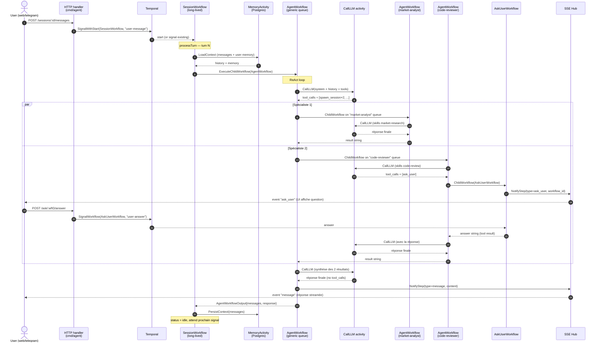

# Session flow — séquence d'un message utilisateur

Diagramme de séquence d'un tour complet : un user envoie un message, la session
charge son contexte, lance l'agent générique qui délègue à deux sous-agents
spécialisés, l'un d'eux pose une question à l'user, puis la réponse finale est
streamée vers l'UI.

## Points clés

- **Generic agent et specific agents = même `AgentWorkflow`**, lancée sur des
  task queues différentes (`agent-default`, `market-analyst`, `code-reviewer`).
  La queue détermine les skills chargés via
  `workflow.GetInfo(ctx).TaskQueueName` → `LoadSkillsForQueue`.
- **`spawn_session`** est un *tool* implémenté comme **child workflow**
  (cf. `buildChildInput` dans `workflow/agent.go`), pas une activity. Le LLM
  choisit la queue cible via le champ `task_queue` de son tool input.
- **`ask_user`** est aussi un child workflow (`AskUserWorkflow`) qui bloque sur
  un signal Temporal. Son `WorkflowID` suit la convention
  `{sessionID}-tool-ask_user-{N}` pour que le SSE puisse router la question
  vers la bonne session UI même quand c'est un sous-agent qui la pose.
- Côté UI, le user voit **3 events SSE** dans l'ordre :
  `tool_calls` (le générique a appelé `spawn_session` ×2), `ask_user`
  (du sous-agent), puis `message` (la synthèse finale).
- La persistance est faite **uniquement par `SessionWorkflow`** après chaque
  turn, pas par les `AgentWorkflow` enfants. Les sous-agents n'ont pas de
  mémoire propre — leur historique meurt avec leur exécution.
